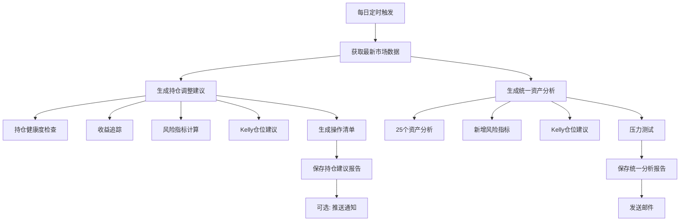

# 📊 Russ交易策略 - 增强版报告自动生成方案

**日期**: 2025-10-21
**版本**: v2.0 Enhanced Edition

---

## 🚀 快速操作指南

> **这是完整的操作手册**：看这个章节就能知道如何生成三大报告

### 📋 前置检查清单

在生成报告前，请确认：

- [ ] **持仓数据已更新**: `data/positions_YYYYMMDD.json` 已创建并填入最新数据
- [ ] **工作目录正确**: 在项目根目录 `/Users/russ/PycharmProjects/stock-analysis/`
- [ ] **Python环境激活**: 虚拟环境已激活（如有）
- [ ] **网络连接正常**: akshare需要联网获取市场数据

---

### 📊 报告1: 持仓调整建议报告（每日）

**功能**: 生成包含持仓健康度、风险指标、Kelly仓位建议、具体操作清单的完整报告

**前置条件**:
- 持仓数据文件：`data/positions_YYYYMMDD.json`（自动读取最新日期）
- 程序会自动从akshare获取市场数据

**生成命令**:

```bash
# 方式1: 生成今日报告（推荐）
cd /Users/russ/PycharmProjects/stock-analysis
python russ_trading_strategy/daily_position_report_generator.py

# 方式2: 生成指定日期报告
python russ_trading_strategy/daily_position_report_generator.py --date 2025-10-24

# 方式3: 自动更新持仓数据并生成
python russ_trading_strategy/daily_position_report_generator.py --auto-update
```

**输出位置**:
- 文件路径: `reports/daily/YYYY-MM/持仓调整建议_YYYYMMDD_增强版.md`
- 示例: `reports/daily/2025-10/持仓调整建议_20251024_增强版.md`

**报告内容**:
1. ✅ 今日市场表现（沪深300/创业板/科创50/恒科）
2. ✅ 持仓健康度诊断（评分+问题分析）
3. ✅ 收益表现与目标达成（三大目标进度）
4. ✅ 机构级风险管理（VaR/CVaR/波动率等10+指标）
5. ✅ 智能仓位建议（Kelly公式最优仓位）
6. ✅ 风险预警中心（分级预警）
7. ✅ 立即执行操作清单（按优先级排序）
8. ✅ 激进持仓建议（翻倍目标方案）

---

### 📧 报告2: 统一资产分析报告（每日+邮件）

**功能**: 分析25个资产（指数/板块/个股），生成11维度分析报告并发送邮件

**前置条件**:
- 邮件配置：`config/email_config.yaml` 已配置邮箱信息
- 程序会自动从akshare获取所有资产数据

**生成命令**:

```bash
# 方式1: 生成报告并发送邮件（推荐）
cd /Users/russ/PycharmProjects/stock-analysis
python russ_trading_strategy/run_unified_analysis.py --email

# 方式2: 仅生成报告不发邮件
python russ_trading_strategy/run_unified_analysis.py

# 方式3: 分析指定资产
python russ_trading_strategy/run_unified_analysis.py --assets CYBZ HKTECH SANHUA_A --email

# 方式4: 列出所有可分析资产
python russ_trading_strategy/run_unified_analysis.py --list
```

**输出形式**:
- 📧 **邮件**：发送到配置的邮箱
- 📄 **文件**：`reports/daily/YYYY/MM/统一资产分析_YYYYMMDD.md`（如指定保存路径）

**分析的25个资产**:

| 类别 | 资产 |
|------|------|
| **核心指数(7个)** | 沪深300、创业板、科创50、中证500、恒生科技、上证50、中证1000 |
| **行业板块(11个)** | 证券、白酒、医药、科技、新能源、消费、地产、银行、煤炭、化工、军工 |
| **个股(7个)** | 阿里巴巴、三花智控、比亚迪、宁德时代、茅台、恒瑞医药、中国平安 |

**每个资产的分析维度**:
1. 📈 技术面（MACD/RSI/均线/K线形态）
2. 💰 资金面（主力资金流入流出）
3. 📊 量价关系（成交量与价格匹配度）
4. 🎯 历史表现（10日/20日/60日收益率）
5. 🔄 波动率分析
6. 📉 回撤分析
7. 🎲 胜率统计
8. 🌡️ 市场情绪
9. 🆕 风险指标（夏普/VaR/最大回撤）
10. 🆕 Kelly最优仓位建议
11. 🆕 风险预警

---

### 📅 报告3: 月度投资计划与复盘

**功能**: 基于市场数据、博主观点、机构研报生成下月投资计划和本月复盘

**前置条件**:
- 市场数据：程序自动获取
- 外部观点：需要手动收集并输入（可选）
- 当前持仓：`data/positions_YYYYMMDD.json`

**生成命令**:

```bash
# 方式1: 通过Python脚本生成（推荐）
cd /Users/russ/PycharmProjects/stock-analysis
python -c "
from russ_trading_strategy.monthly_plan_generator import MonthlyPlanGenerator
import json
from datetime import datetime

# 加载市场数据（需要先准备）
with open('data/market_data_monthly.json', 'r') as f:
    market_data = json.load(f)

# 加载当前持仓
with open('data/positions_20251024.json', 'r') as f:
    positions = json.load(f)

# 生成计划
generator = MonthlyPlanGenerator({
    'min_position': 0.70,
    'max_position': 0.90,
    'target_annual_return': 0.15,
    'risk_preference': 'aggressive'
})

plan = generator.generate_monthly_plan(
    plan_month='2025-11',
    market_data=market_data,
    current_positions=positions,
    blogger_insights=[
        '创业板2935点确认历史底部',
        '证券板块建议减仓',
        '纳斯达克继续强势'
    ]
)

# 保存报告
with open('reports/monthly/投资计划_2025-11.md', 'w') as f:
    f.write(plan['report'])
"

# 方式2: 手动创建（基于模板）
# 复制上月计划，手动修改数据
cp reports/monthly/投资计划_2025-10.md reports/monthly/投资计划_2025-11.md
# 然后编辑文件，更新市场评估、仓位策略、行动清单等
```

**输出位置**:
- 文件路径: `reports/monthly/投资计划_YYYY-MM.md`
- 示例: `reports/monthly/投资计划_2025-11.md`

**报告内容**:
1. 📊 市场评估（各指数表现+趋势判断）
2. 📝 关键观点（博主/机构观点汇总）
3. 🎯 仓位策略（目标区间+调整建议）
4. 💼 资产配置建议（推荐配置+理由）
5. ✅ 本月行动清单（按优先级分级）
6. ⚠️ 风险提示
7. 💡 投资机会
8. 📈 上月复盘（目标完成度+经验教训）

---

### 🔄 完整工作流程示例

假设今天是**2025-10-25周五**，我要生成三份报告：

```bash
# Step 1: 更新持仓数据
cd /Users/russ/PycharmProjects/stock-analysis
cp data/positions_20251024.json data/positions_20251025.json
# 编辑 positions_20251025.json，更新市值和仓位

# Step 2: 生成持仓调整建议报告
python russ_trading_strategy/daily_position_report_generator.py
# 输出: reports/daily/2025-10/持仓调整建议_20251025_增强版.md

# Step 3: 生成并发送统一资产分析邮件
python russ_trading_strategy/run_unified_analysis.py --email
# 输出: 邮件发送到邮箱

# Step 4: 月末生成下月投资计划（仅月末执行）
# 如果今天是月末，执行：
python -c "from russ_trading_strategy.monthly_plan_generator import MonthlyPlanGenerator; ..."
# 输出: reports/monthly/投资计划_2025-11.md
```

---

### 📌 常见问题排查

**Q1: 持仓数据找不到？**
```bash
# 检查是否有最新日期的持仓文件
ls -lh data/positions_*.json

# 如果没有，复制最近的文件
cp data/positions_20251023.json data/positions_20251025.json
```

**Q2: 报告生成失败？**
```bash
# 检查Python路径和依赖
which python
pip list | grep akshare

# 查看详细错误日志
python russ_trading_strategy/daily_position_report_generator.py --debug
```

**Q3: 邮件发送失败？**
```bash
# 检查邮箱配置
cat config/email_config.yaml

# 测试邮件发送
python -c "from russ_trading_strategy.unified_email_notifier import UnifiedEmailNotifier; notifier = UnifiedEmailNotifier(); notifier.send_test_email()"
```

---

## 🎯 目标

将原有的报告生成系统升级到**机构投资级别**，每天自动生成两类报告：

### 1. **持仓调整建议报告** (每日生成)
- 持仓健康度分析
- 机构级风险指标
- Kelly公式智能仓位
- 具体操作清单
- 收益预测

### 2. **统一资产分析报告** (每日生成 + 邮件)
- 原有25个资产11维度分析
- **新增机构级增强**:
  - 风险指标(夏普/回撤/VaR)
  - Kelly仓位建议
  - 压力测试
  - 详细风险预警

---

## 📋 系统架构

### 原有系统

```
scripts/russ_trading_strategy/
├── run_unified_analysis.py          # 统一分析主程序
├── unified_email_notifier.py        # 邮件通知
├── unified_config.py                # 资产配置
├── russ_strategy_runner.py          # Russ策略主程序
├── position_health_checker.py       # 持仓健康度
├── performance_tracker.py           # 收益追踪
├── potential_analyzer.py            # 潜在空间
└── monthly_plan_generator.py        # 月度计划
```

### 新增模块(已实现)

```
scripts/russ_trading_strategy/
├── risk_manager.py                  # ✅ 风险管理器
├── dynamic_position_manager.py      # ✅ 智能仓位管理
├── backtest_engine_enhanced.py      # ✅ 增强回测引擎
├── data_manager.py                  # ✅ 数据管理器
└── visualizer.py                    # ✅ 可视化模块
```

### 需要实现的增强脚本

```
scripts/russ_trading_strategy/
├── daily_position_report_generator.py   # 🆕 每日持仓建议生成器
└── unified_analysis_enhanced.py         # 🆕 增强版统一分析
```

---

## 🔄 工作流程

### 每日自动生成流程



---

## 📊 报告1: 持仓调整建议

### 生成逻辑

```python
# 伪代码
def generate_daily_position_report(date):
    # 1. 获取市场数据
    market_data = fetch_market_data(date)  # 沪深300、创业板、恒科等

    # 2. 加载持仓
    positions = load_positions()  # 从 data/positions_YYYYMMDD.json (自动读取最新日期)

    # 3. 基础分析
    health_check = PositionHealthChecker().check(positions)
    performance = PerformanceTracker().track(capital, market_data)
    potential = PotentialAnalyzer().analyze(market_data)

    # 4. 增强分析(新增)
    risk_metrics = RiskManager().calculate_risk_metrics(
        equity_history, returns_history
    )
    position_advice = DynamicPositionManager().generate_advice(
        positions, market_data
    )

    # 5. 生成报告
    report = format_position_report(
        date=date,
        health=health_check,
        performance=performance,
        potential=potential,
        risk=risk_metrics,
        advice=position_advice
    )

    # 6. 保存
    save_report(report, f"持仓调整建议_{date}.md")
```

### 报告结构

```markdown
# 📊 Russ个人持仓调整策略报告(增强版)
生成时间: 2025-10-21

## 🔥 今日关键发现
- 市场数据更新
- 关键信号

## 🏥 持仓健康度诊断
- 健康评分
- 当前持仓明细
- 问题分析

## 🎯 收益表现与目标达成
- 三大目标完成情况
- 收益统计

## 🛡️ 机构级风险管理分析
- 10+风险指标
- 风险等级评估

## 💡 智能仓位建议(Kelly公式)
- 理论最优仓位
- 目标仓位结构

## 🚨 立即执行操作清单
- 第一优先级(本周)
- 第二优先级(1-2周)
- 第三优先级(1个月)

## 💰 预期收益测算
- 执行vs不执行对比

## ⏰ 执行时间表
- 本周计划
- 下周计划

## 💬 关键提醒
```

---

## 📊 报告2: 统一资产分析(增强版)

### 生成逻辑

```python
# 伪代码
def generate_unified_analysis_enhanced(date):
    # 1. 运行原有分析
    runner = UnifiedAnalysisRunner()
    results = runner.analyze_assets()  # 25个资产

    # 2. 对每个资产增强分析
    for asset_key, data in results['assets'].items():
        # 2.1 计算风险指标
        if has_price_history(asset_key):
            risk_metrics = RiskManager().calculate_for_asset(asset_key)
            data['enhanced_risk'] = risk_metrics

        # 2.2 Kelly仓位建议
        kelly_advice = calculate_kelly_position(
            win_rate=data['historical_analysis']['20d']['up_prob'],
            avg_return=data['historical_analysis']['20d']['mean_return']
        )
        data['kelly_position'] = kelly_advice

        # 2.3 压力测试(可选,针对核心标的)
        if asset_key in CORE_ASSETS:
            stress_test = run_stress_test(asset_key)
            data['stress_test'] = stress_test

    # 3. 生成增强版报告
    report = format_enhanced_report(results)

    # 4. 发送邮件
    if send_email:
        send_email_report(report)
```

### 报告结构(新增部分)

在原有报告基础上,每个资产新增:

```markdown
## CYBZ: 创业板指

### (原有11维度分析)
...

### 🆕 机构级风险指标
- **夏普比率**: 3.5 (优秀)
- **最大回撤**: -8.5%
- **年化波动率**: 35%
- **VaR(95%)**: -2.1%
- **索提诺比率**: 4.2

### 🆕 Kelly最优仓位
- **当前仓位**: 12%
- **Kelly建议**: 15-18%
- **调整建议**: 可加仓3-6%

### 🆕 风险预警
- ⚠️ 波动率偏高,需控制仓位
- ✅ 夏普比率优秀,风险调整后收益好
```

---

## 🛠️ 实现步骤

### 第一步: 创建每日持仓报告生成器

```bash
scripts/russ_trading_strategy/daily_position_report_generator.py
```

**功能**:
- 自动获取市场数据(akshare)
- 集成所有分析模块
- 生成完整持仓建议报告
- 保存到 reports/daily/YYYY-MM/

**使用方式**:
```bash
# 手动生成今日报告
python scripts/russ_trading_strategy/daily_position_report_generator.py

# 生成指定日期报告
python scripts/russ_trading_strategy/daily_position_report_generator.py --date 2025-10-21

# 发送通知(可选)
python scripts/russ_trading_strategy/daily_position_report_generator.py --notify
```

### 第二步: 增强统一资产分析

修改 `run_unified_analysis.py`:
- 新增 `--enhanced` 参数
- 集成RiskManager
- 集成DynamicPositionManager
- 在报告中添加增强指标

**使用方式**:
```bash
# 增强版分析
python scripts/russ_trading_strategy/run_unified_analysis.py --enhanced --email

# 兼容原版
python scripts/russ_trading_strategy/run_unified_analysis.py --email
```

### 第三步: 设置定时任务

**Mac/Linux (crontab)**:
```bash
# 每个交易日17:00生成持仓报告
0 17 * * 1-5 cd /Users/russ/PycharmProjects/stock-analysis && python scripts/russ_trading_strategy/daily_position_report_generator.py

# 每个交易日17:30生成并发送统一分析邮件
30 17 * * 1-5 cd /Users/russ/PycharmProjects/stock-analysis && python scripts/russ_trading_strategy/run_unified_analysis.py --enhanced --email
```

**Windows (任务计划程序)**:
- 创建任务,每天17:00运行
- 程序: `python.exe`
- 参数: `scripts/russ_trading_strategy/daily_position_report_generator.py`

---

## 📝 配置文件

### 持仓配置 (data/positions_YYYYMMDD.json)

**文件格式**：

```json
[
  {
    "asset_name": "恒生科技ETF",
    "asset_key": "513180",
    "current_value": 154200,
    "position_ratio": 0.297
  },
  {
    "asset_name": "证券ETF",
    "asset_key": "512880",
    "current_value": 118450,
    "position_ratio": 0.228
  }
]
```

**字段说明**：
- `asset_name`: 资产名称
- `asset_key`: 资产代码（股票/ETF代码）
- `current_value`: 当前市值（单位：元）
- `position_ratio`: 仓位占比（小数形式，如 29.7% = 0.297）

**日常使用流程**：

1. **持仓发生变化时**：
   ```bash
   # 复制最新的持仓文件
   cp data/positions_20251024.json data/positions_20251025.json
   ```

2. **修改持仓数据**：
   - 直接编辑 JSON 文件
   - 更新 `current_value`（市值）
   - 更新 `position_ratio`（仓位占比）
   - 买入新标的：添加新对象
   - 清仓标的：删除对应对象

3. **重新生成报告**：
   ```bash
   # 报告程序会自动读取最新日期的持仓文件
   python scripts/russ_trading_strategy/daily_position_report_generator.py
   ```

**示例场景**：

```bash
# 场景：周四买入1万元恒生科技ETF
# 1. 复制持仓文件
cp data/positions_20251023.json data/positions_20251024.json

# 2. 编辑 positions_20251024.json
# 修改恒生科技ETF:
#   current_value: 144200 → 154200
#   position_ratio: 0.277 → 0.297

# 3. 重新生成报告（会自动读取最新的持仓文件）
python scripts/russ_trading_strategy/daily_position_report_generator.py
```

### 报告配置 (config/report_config.yaml)

```yaml
# 持仓报告配置
position_report:
  auto_generate: true
  save_path: "reports/daily/{year}-{month}/"
  filename_format: "持仓调整建议_{date}_增强版.md"

  # 风险阈值
  risk_thresholds:
    max_position: 0.90  # 最大总仓位
    min_cash: 0.10      # 最小现金预留
    max_single: 0.20    # 单一标的最大仓位

  # Kelly参数
  kelly_config:
    conservative_factor: 0.5  # 保守系数(Kelly*0.5)
    max_leverage: 1.0         # 最大杠杆

# 统一分析增强配置
unified_analysis_enhanced:
  enable_risk_metrics: true      # 启用风险指标
  enable_kelly_advice: true      # 启用Kelly建议
  enable_stress_test: false      # 启用压力测试(耗时)

  # 核心资产(进行详细分析)
  core_assets:
    - CYBZ
    - HS300
    - HKTECH
    - CN_SECURITIES
```

---

## 🎯 预期效果

### 持仓报告

**每日自动生成**:
- 📄 `/reports/daily/2025-10/持仓调整建议_20251021_增强版.md`
- 📄 `/reports/daily/2025-10/持仓调整建议_20251022_增强版.md`
- ...

**内容**:
- ✅ 完整的持仓健康度分析
- ✅ 机构级风险指标
- ✅ 智能仓位建议
- ✅ 具体操作清单
- ✅ 收益预测

### 统一分析报告

**每日自动发送邮件**:
- 📧 主题: `[增强版] 统一资产分析报告 - 2025-10-21`
- 📊 25个资产完整分析
- 🆕 每个资产新增:
  - 风险指标
  - Kelly仓位
  - 风险预警

---

## 💡 后续优化

### 短期(1-2周)
1. ✅ 实现自动化生成脚本
2. ✅ 配置定时任务
3. ✅ 测试报告质量

### 中期(1个月)
1. 添加微信推送(可选)
2. Web仪表盘展示
3. 历史报告对比

### 长期(3-6个月)
1. 机器学习预测集成
2. 实时监控告警
3. 移动端App

---

## 📚 参考文档

- 原始文档: `/reports/daily/2025-10/持仓调整建议_20251020_晚间更新.md`
- 增强版示例: `/reports/daily/2025-10/持仓调整建议_20251021_增强版.md`
- 基础报告: `/reports/daily/2025-10/russ_strategy_report_20251021.md`
- 系统升级文档: `/reports/2025-10-20_系统升级实现逻辑.md`

---

## 💡 使用场景

以后当你需要生成报告时：

### 场景1：每日例行报告

```bash
# 1. 告诉我："帮我看下增强版报告生成方案.md"
# 2. 我会根据文档生成持仓调整建议 + 发送市场分析邮件

cd /Users/russ/PycharmProjects/stock-analysis
python russ_trading_strategy/daily_position_report_generator.py
python russ_trading_strategy/run_unified_analysis.py --email
```

**输出结果**:
- ✅ 持仓调整建议报告：`reports/daily/2025-10/持仓调整建议_20251025_增强版.md`
- ✅ 市场分析邮件：发送到你的邮箱

---

### 场景2：月末生成投资计划

```bash
# 告诉我："月末了，帮我生成11月投资计划"
# 我会根据文档执行月度计划生成流程

# 步骤：
# 1. 收集本月市场数据
# 2. 汇总博主/机构观点
# 3. 生成下月投资计划
# 4. 复盘本月执行情况
```

**输出结果**:
- ✅ 月度投资计划：`reports/monthly/投资计划_2025-11.md`

---

### 场景3：持仓变化后更新报告

```bash
# 告诉我："我买了xxx，帮我更新持仓数据并重新生成报告"
# 我会：
# 1. 更新 positions_YYYYMMDD.json
# 2. 重新生成持仓调整建议报告

# 示例：
# "我周四加了恒生科技ETF 1w块，帮我更新持仓"
#
# 我会执行：
# - 复制最新的持仓文件
# - 修改恒生科技ETF的市值和仓位
# - 重新生成报告，更新所有相关数据
```

**输出结果**:
- ✅ 更新的持仓文件：`data/positions_20251024.json`
- ✅ 更新的持仓报告：`reports/daily/2025-10/持仓调整建议_20251024_增强版.md`

---

### 场景4：排查报告问题

```bash
# 告诉我："报告生成失败了，帮我看看是什么问题"
# 我会：
# 1. 检查持仓数据文件是否存在
# 2. 检查Python环境和依赖
# 3. 查看错误日志
# 4. 提供解决方案
```

---

## 📖 快速索引

### 我想...

| 需求 | 跳转章节 |
|------|---------|
| **马上生成三个报告** | [🚀 快速操作指南](#-快速操作指南) |
| **查看实际使用案例** | [💡 使用场景](#-使用场景) |
| 生成持仓调整建议 | [📊 报告1: 持仓调整建议报告](#-报告1-持仓调整建议报告每日) |
| 发送市场分析邮件 | [📧 报告2: 统一资产分析报告](#-报告2-统一资产分析报告每日邮件) |
| 生成月度投资计划 | [📅 报告3: 月度投资计划与复盘](#-报告3-月度投资计划与复盘) |
| 了解持仓数据格式 | [📝 配置文件](#-配置文件) |
| 查看完整工作流程 | [🔄 完整工作流程示例](#-完整工作流程示例) |
| 排查报告生成问题 | [📌 常见问题排查](#-常见问题排查) |
| 了解系统架构 | [📋 系统架构](#-系统架构) |
| 设置定时任务 | [第三步: 设置定时任务](#第三步-设置定时任务) |

---

**文档维护**: Claude Code
**最后更新**: 2025-10-25
**版本**: v2.1 - 新增快速操作指南
