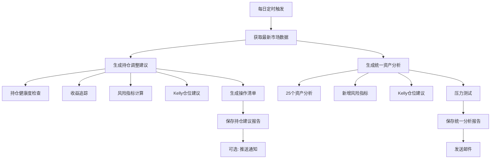

# 📊 Russ交易策略 - 增强版报告自动生成方案

**日期**: 2025-10-21
**版本**: v2.0 Enhanced Edition

---

## 🎯 目标

将原有的报告生成系统升级到**机构投资级别**，每天自动生成两类报告：

### 1. **持仓调整建议报告** (每日生成)
- 持仓健康度分析
- 机构级风险指标
- Kelly公式智能仓位
- 具体操作清单
- 收益预测

### 2. **统一资产分析报告** (每日生成 + 邮件)
- 原有25个资产11维度分析
- **新增机构级增强**:
  - 风险指标(夏普/回撤/VaR)
  - Kelly仓位建议
  - 压力测试
  - 详细风险预警

---

## 📋 系统架构

### 原有系统

```
scripts/russ_trading_strategy/
├── run_unified_analysis.py          # 统一分析主程序
├── unified_email_notifier.py        # 邮件通知
├── unified_config.py                # 资产配置
├── russ_strategy_runner.py          # Russ策略主程序
├── position_health_checker.py       # 持仓健康度
├── performance_tracker.py           # 收益追踪
├── potential_analyzer.py            # 潜在空间
└── monthly_plan_generator.py        # 月度计划
```

### 新增模块(已实现)

```
scripts/russ_trading_strategy/
├── risk_manager.py                  # ✅ 风险管理器
├── dynamic_position_manager.py      # ✅ 智能仓位管理
├── backtest_engine_enhanced.py      # ✅ 增强回测引擎
├── data_manager.py                  # ✅ 数据管理器
└── visualizer.py                    # ✅ 可视化模块
```

### 需要实现的增强脚本

```
scripts/russ_trading_strategy/
├── daily_position_report_generator.py   # 🆕 每日持仓建议生成器
└── unified_analysis_enhanced.py         # 🆕 增强版统一分析
```

---

## 🔄 工作流程

### 每日自动生成流程



---

## 📊 报告1: 持仓调整建议

### 生成逻辑

```python
# 伪代码
def generate_daily_position_report(date):
    # 1. 获取市场数据
    market_data = fetch_market_data(date)  # 沪深300、创业板、恒科等

    # 2. 加载持仓
    positions = load_positions()  # 从positions.json

    # 3. 基础分析
    health_check = PositionHealthChecker().check(positions)
    performance = PerformanceTracker().track(capital, market_data)
    potential = PotentialAnalyzer().analyze(market_data)

    # 4. 增强分析(新增)
    risk_metrics = RiskManager().calculate_risk_metrics(
        equity_history, returns_history
    )
    position_advice = DynamicPositionManager().generate_advice(
        positions, market_data
    )

    # 5. 生成报告
    report = format_position_report(
        date=date,
        health=health_check,
        performance=performance,
        potential=potential,
        risk=risk_metrics,
        advice=position_advice
    )

    # 6. 保存
    save_report(report, f"持仓调整建议_{date}.md")
```

### 报告结构

```markdown
# 📊 Russ个人持仓调整策略报告(增强版)
生成时间: 2025-10-21

## 🔥 今日关键发现
- 市场数据更新
- 关键信号

## 🏥 持仓健康度诊断
- 健康评分
- 当前持仓明细
- 问题分析

## 🎯 收益表现与目标达成
- 三大目标完成情况
- 收益统计

## 🛡️ 机构级风险管理分析
- 10+风险指标
- 风险等级评估

## 💡 智能仓位建议(Kelly公式)
- 理论最优仓位
- 目标仓位结构

## 🚨 立即执行操作清单
- 第一优先级(本周)
- 第二优先级(1-2周)
- 第三优先级(1个月)

## 💰 预期收益测算
- 执行vs不执行对比

## ⏰ 执行时间表
- 本周计划
- 下周计划

## 💬 关键提醒
```

---

## 📊 报告2: 统一资产分析(增强版)

### 生成逻辑

```python
# 伪代码
def generate_unified_analysis_enhanced(date):
    # 1. 运行原有分析
    runner = UnifiedAnalysisRunner()
    results = runner.analyze_assets()  # 25个资产

    # 2. 对每个资产增强分析
    for asset_key, data in results['assets'].items():
        # 2.1 计算风险指标
        if has_price_history(asset_key):
            risk_metrics = RiskManager().calculate_for_asset(asset_key)
            data['enhanced_risk'] = risk_metrics

        # 2.2 Kelly仓位建议
        kelly_advice = calculate_kelly_position(
            win_rate=data['historical_analysis']['20d']['up_prob'],
            avg_return=data['historical_analysis']['20d']['mean_return']
        )
        data['kelly_position'] = kelly_advice

        # 2.3 压力测试(可选,针对核心标的)
        if asset_key in CORE_ASSETS:
            stress_test = run_stress_test(asset_key)
            data['stress_test'] = stress_test

    # 3. 生成增强版报告
    report = format_enhanced_report(results)

    # 4. 发送邮件
    if send_email:
        send_email_report(report)
```

### 报告结构(新增部分)

在原有报告基础上,每个资产新增:

```markdown
## CYBZ: 创业板指

### (原有11维度分析)
...

### 🆕 机构级风险指标
- **夏普比率**: 3.5 (优秀)
- **最大回撤**: -8.5%
- **年化波动率**: 35%
- **VaR(95%)**: -2.1%
- **索提诺比率**: 4.2

### 🆕 Kelly最优仓位
- **当前仓位**: 12%
- **Kelly建议**: 15-18%
- **调整建议**: 可加仓3-6%

### 🆕 风险预警
- ⚠️ 波动率偏高,需控制仓位
- ✅ 夏普比率优秀,风险调整后收益好
```

---

## 🛠️ 实现步骤

### 第一步: 创建每日持仓报告生成器

```bash
scripts/russ_trading_strategy/daily_position_report_generator.py
```

**功能**:
- 自动获取市场数据(akshare)
- 集成所有分析模块
- 生成完整持仓建议报告
- 保存到 reports/daily/YYYY-MM/

**使用方式**:
```bash
# 手动生成今日报告
python scripts/russ_trading_strategy/daily_position_report_generator.py

# 生成指定日期报告
python scripts/russ_trading_strategy/daily_position_report_generator.py --date 2025-10-21

# 发送通知(可选)
python scripts/russ_trading_strategy/daily_position_report_generator.py --notify
```

### 第二步: 增强统一资产分析

修改 `run_unified_analysis.py`:
- 新增 `--enhanced` 参数
- 集成RiskManager
- 集成DynamicPositionManager
- 在报告中添加增强指标

**使用方式**:
```bash
# 增强版分析
python scripts/russ_trading_strategy/run_unified_analysis.py --enhanced --email

# 兼容原版
python scripts/russ_trading_strategy/run_unified_analysis.py --email
```

### 第三步: 设置定时任务

**Mac/Linux (crontab)**:
```bash
# 每个交易日17:00生成持仓报告
0 17 * * 1-5 cd /Users/russ/PycharmProjects/stock-analysis && python scripts/russ_trading_strategy/daily_position_report_generator.py

# 每个交易日17:30生成并发送统一分析邮件
30 17 * * 1-5 cd /Users/russ/PycharmProjects/stock-analysis && python scripts/russ_trading_strategy/run_unified_analysis.py --enhanced --email
```

**Windows (任务计划程序)**:
- 创建任务,每天17:00运行
- 程序: `python.exe`
- 参数: `scripts/russ_trading_strategy/daily_position_report_generator.py`

---

## 📝 配置文件

### 持仓配置 (data/positions.json)

```json
{
  "update_date": "2025-10-21",
  "total_capital": 1000000,
  "positions": [
    {
      "asset_name": "证券ETF",
      "asset_key": "512880",
      "position_ratio": 0.45,
      "current_value": 450000
    },
    ...
  ]
}
```

### 报告配置 (config/report_config.yaml)

```yaml
# 持仓报告配置
position_report:
  auto_generate: true
  save_path: "reports/daily/{year}-{month}/"
  filename_format: "持仓调整建议_{date}_增强版.md"

  # 风险阈值
  risk_thresholds:
    max_position: 0.90  # 最大总仓位
    min_cash: 0.10      # 最小现金预留
    max_single: 0.20    # 单一标的最大仓位

  # Kelly参数
  kelly_config:
    conservative_factor: 0.5  # 保守系数(Kelly*0.5)
    max_leverage: 1.0         # 最大杠杆

# 统一分析增强配置
unified_analysis_enhanced:
  enable_risk_metrics: true      # 启用风险指标
  enable_kelly_advice: true      # 启用Kelly建议
  enable_stress_test: false      # 启用压力测试(耗时)

  # 核心资产(进行详细分析)
  core_assets:
    - CYBZ
    - HS300
    - HKTECH
    - CN_SECURITIES
```

---

## 🎯 预期效果

### 持仓报告

**每日自动生成**:
- 📄 `/reports/daily/2025-10/持仓调整建议_20251021_增强版.md`
- 📄 `/reports/daily/2025-10/持仓调整建议_20251022_增强版.md`
- ...

**内容**:
- ✅ 完整的持仓健康度分析
- ✅ 机构级风险指标
- ✅ 智能仓位建议
- ✅ 具体操作清单
- ✅ 收益预测

### 统一分析报告

**每日自动发送邮件**:
- 📧 主题: `[增强版] 统一资产分析报告 - 2025-10-21`
- 📊 25个资产完整分析
- 🆕 每个资产新增:
  - 风险指标
  - Kelly仓位
  - 风险预警

---

## 💡 后续优化

### 短期(1-2周)
1. ✅ 实现自动化生成脚本
2. ✅ 配置定时任务
3. ✅ 测试报告质量

### 中期(1个月)
1. 添加微信推送(可选)
2. Web仪表盘展示
3. 历史报告对比

### 长期(3-6个月)
1. 机器学习预测集成
2. 实时监控告警
3. 移动端App

---

## 📚 参考文档

- 原始文档: `/reports/daily/2025-10/持仓调整建议_20251020_晚间更新.md`
- 增强版示例: `/reports/daily/2025-10/持仓调整建议_20251021_增强版.md`
- 基础报告: `/reports/daily/2025-10/russ_strategy_report_20251021.md`
- 系统升级文档: `/reports/2025-10-20_系统升级实现逻辑.md`

---

**文档维护**: Claude Code
**最后更新**: 2025-10-21
